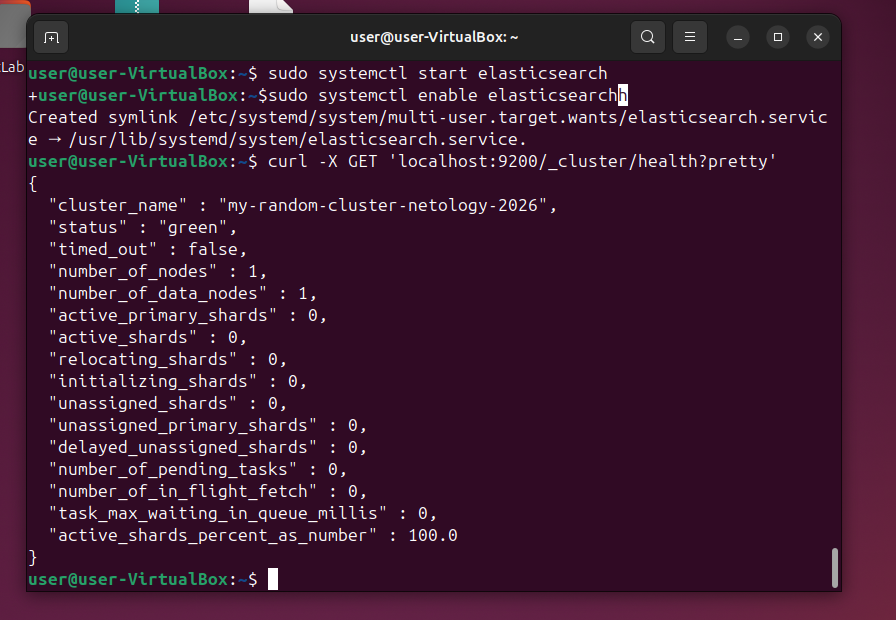
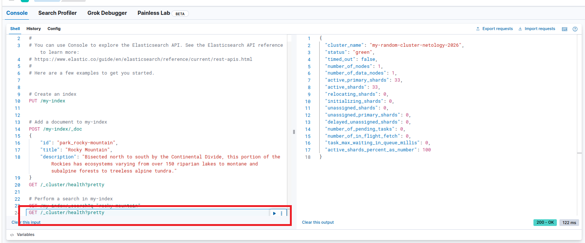
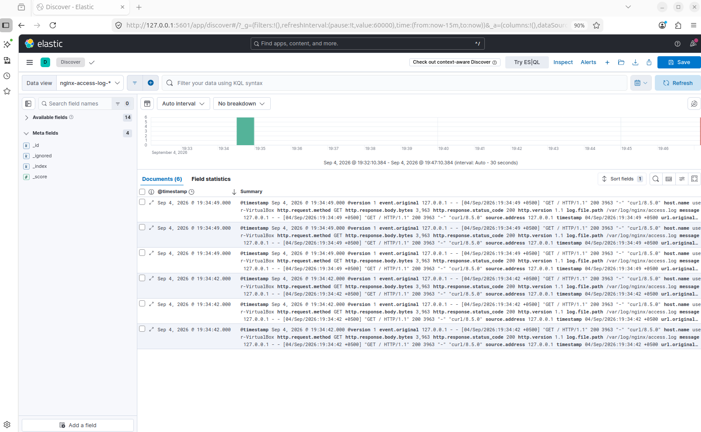
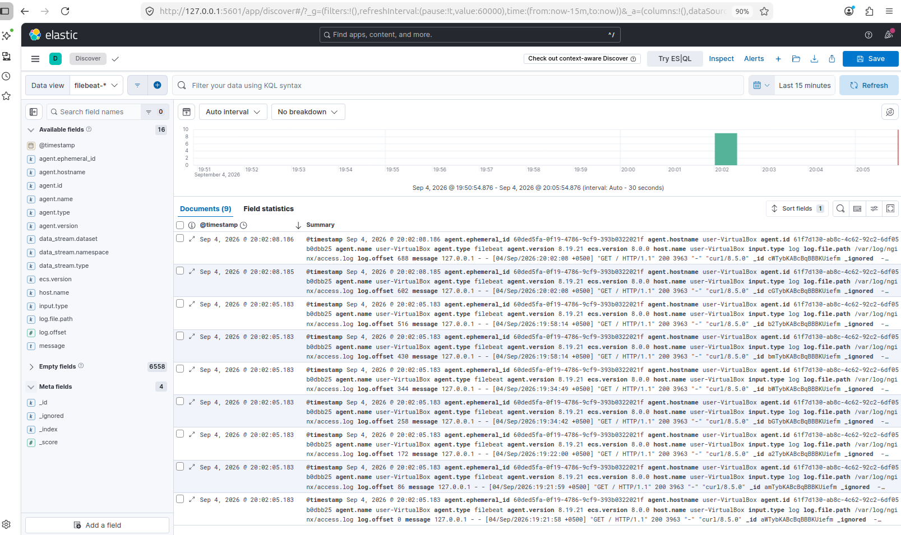

# Домашнее задание к занятию "` «ELK`" - `Шичков Евгений`

### Инструкция по выполнению домашнего задания

   1. Сделайте `fork` данного репозитория к себе в Github и переименуйте его по названию или номеру занятия, например, https://github.com/имя-вашего-репозитория/git-hw или  https://github.com/имя-вашего-репозитория/7-1-ansible-hw).
   2. Выполните клонирование данного репозитория к себе на ПК с помощью команды `git clone`.
   3. Выполните домашнее задание и заполните у себя локально этот файл README.md:
      - впишите вверху название занятия и вашу фамилию и имя
      - в каждом задании добавьте решение в требуемом виде (текст/код/скриншоты/ссылка)
      - для корректного добавления скриншотов воспользуйтесь [инструкцией "Как вставить скриншот в шаблон с решением](https://github.com/netology-code/sys-pattern-homework/blob/main/screen-instruction.md)
      - при оформлении используйте возможности языка разметки md (коротко об этом можно посмотреть в [инструкции  по MarkDown](https://github.com/netology-code/sys-pattern-homework/blob/main/md-instruction.md))
   4. После завершения работы над домашним заданием сделайте коммит (`git commit -m "comment"`) и отправьте его на Github (`git push origin`);
   5. В личном кабинете прикрепите и отправьте ссылку на решение в виде md-файла в вашем Github.
   6. Любые вопросы по выполнению заданий спрашивайте в разделе “Вопросы по заданию” в личном кабинете.
   
Желаем успехов в выполнении домашнего задания!
   
### Дополнительные материалы, которые могут быть полезны для выполнения задания

1. [Руководство по оформлению Markdown файлов](https://gist.github.com/Jekins/2bf2d0638163f1294637#Code)

---

# Домашнее задание по лекции "ELK"

### Задание 1. Elasticsearch (Смена cluster_name)

*Решение:* Установлен Elasticsearch, изменен параметр `cluster_name` на `my-random-cluster-netology-2026`.

---

### Задание 2. Kibana (Dev Tools)

*Решение:* Установлена и запущена Kibana. В разделе Dev Tools выполнен запрос `GET /_cluster/health?pretty`.

---

### Задание 3. Logstash (Отправка логов Nginx)

*Решение:* Установлен Logstash, настроен конфиг для чтения access-логов Nginx (grok). Логи отправлены в Elasticsearch. Индекс `nginx-access-log-*` создан, данные отображаются в Discover.

---

### Задание 4. Filebeat (Переключение на Filebeat)

*Решение:* Logstash остановлен. Установлен и настроен Filebeat (модуль nginx), который отправляет логи напрямую в Elasticsearch. Создан индекс `filebeat-nginx-*`, данные отображаются в Discover (видно поле `agent.type: filebeat`).

